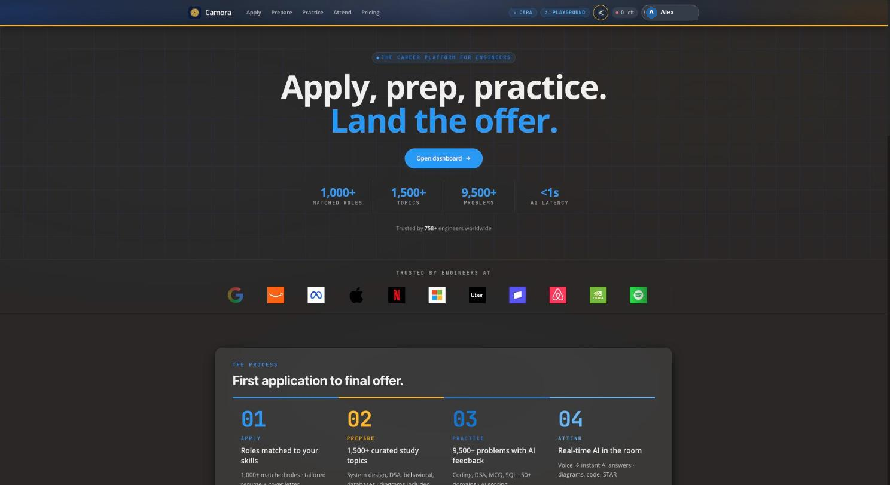
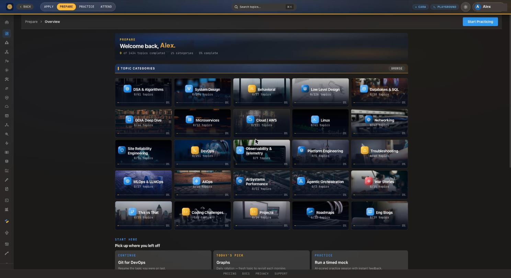
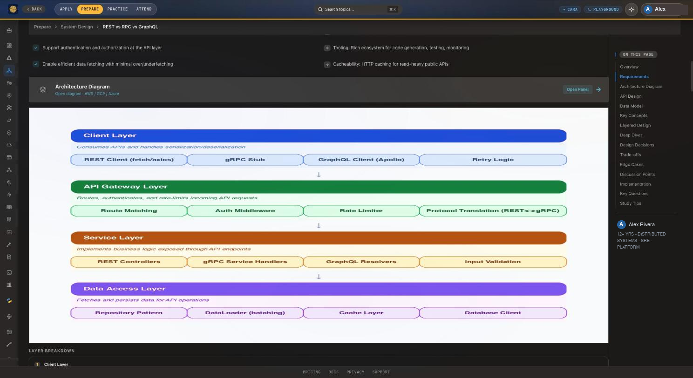
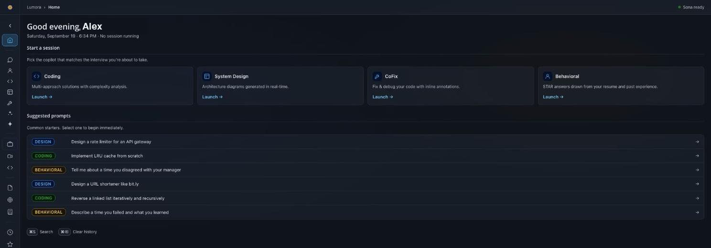
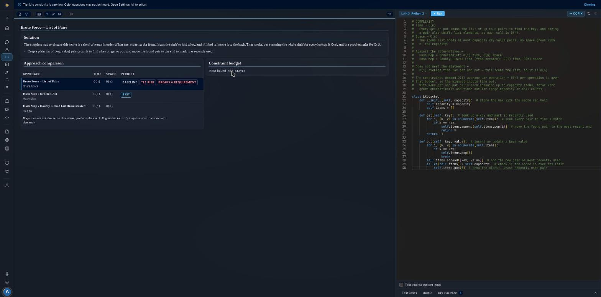
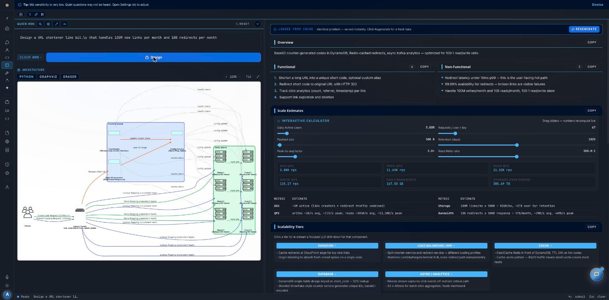
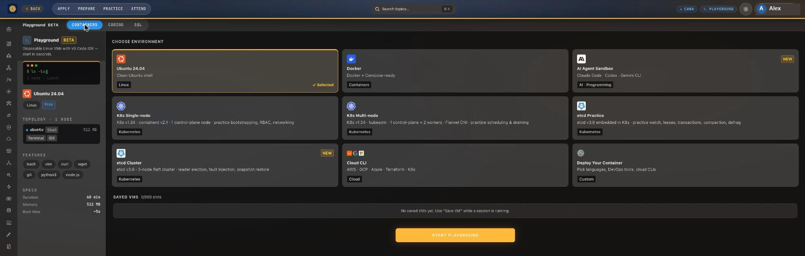
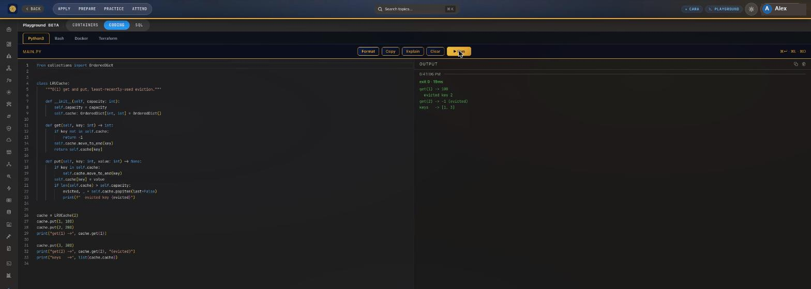
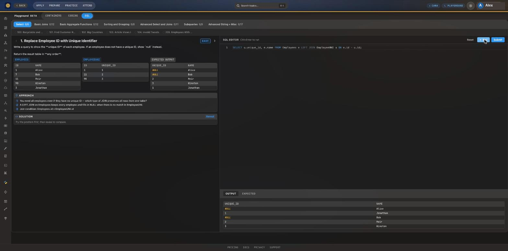

<p align="center">
  
</p>

<h1 align="center">Camora</h1>

<p align="center"><b>Apply, prepare, practice — and get real-time help in the room.</b></p>

<p align="center">
  An open-source platform for technical interviews: 1,400+ curated study topics,
  9,500+ practice problems, disposable Kubernetes/Linux labs, and a live AI copilot.
</p>

<p align="center">
  <a href="https://camora.cariara.com"><b>camora.cariara.com</b></a>
  ·
  <a href="#run-it-locally">Run it locally</a>
  ·
  <a href="CONTRIBUTING.md">Contribute</a>
</p>

<p align="center">
  <a href="LICENSE"></a>
  
  
  
  
  
  
</p>

<p align="center">
  
</p>

---

## What it is

Camora is two products in one monorepo, sharing an account, a database and a design system.

**Capra** is where you study before the interview. It ships 1,434 topics across 25
categories — algorithms, system design, behavioral, low-level design, databases, Linux,
networking, SRE, DevOps, MLOps, Kubernetes and more — each one a long-form deep dive with
generated architecture diagrams rather than a wall of bullet points. Alongside it: coding
and SQL practice, and disposable Linux/Kubernetes/etcd lab VMs you can break and throw away.

**Lumora** is the copilot for the interview itself. It listens, transcribes, works out which
question was actually asked, and streams an answer written in your voice — grounded in your
own resume and notes through a retrieval pipeline, not invented. It has dedicated modes for
coding rounds, system design rounds and behavioral rounds.

## Screenshots

### Prepare — 1,434 topics across 25 categories



### Topic deep dives, with generated architecture diagrams

Every topic is long-form, with an architecture diagram rendered by Graphviz from a spec
file — never hand-drawn SVG, never Mermaid.



### Lumora — pick the copilot for the round you are in



### Coding rounds — approaches compared, not just one answer

Every solution comes with a comparison table: each approach, its time and space complexity,
and a verdict on whether it actually meets the stated constraints.



### System design rounds — diagram, scale maths and tiers

The scale estimator is live: drag a slider and every QPS, bandwidth and storage number
recomputes.



### Playground — disposable labs that boot in seconds

Ubuntu, Docker, single- and multi-node Kubernetes, a 3-node etcd Raft cluster for leader
election and fault injection, and cloud CLIs.



### Playground — code execution

Python, Bash, Docker and Terraform, run in a sandboxed microservice.



### Playground — SQL practice

Graded SQL exercises with the source tables, the expected output and a live editor.



## Architecture

```
                 ┌──────────────────────────┐
  browser  ──────│  apps/camora (React 19)  │
  desktop  ──────│  Vite 8 · Tailwind 4     │
  mobile   ──────└────────────┬─────────────┘
                              │
              ┌───────────────┴────────────────┐
              │                                │
   ┌──────────▼──────────┐        ┌────────────▼────────────┐
   │  lumora-backend     │        │  ascend-backend         │
   │  live interview API │        │  prep / study / billing │
   │  Claude (Anthropic) │        │  Gemini (Google)        │
   └──────┬───────┬──────┘        └────────────┬────────────┘
          │       │                            │
          │       └──────────┬─────────────────┘
          │                  │
   ┌──────▼──────┐   ┌───────▼────────┐   ┌───────────────────┐
   │ ai-services │   │  PostgreSQL    │   │ playground-       │
   │  (FastAPI)  │   │  + pgvector    │   │ backend (Nomad)   │
   │ speaker id  │   │  shared users  │   │ k8s / etcd / linux│
   │ diagrams    │   └────────────────┘   └───────────────────┘
   └─────────────┘
                     ┌──────────────┐
                     │ code-runner  │  sandboxed execution
                     └──────────────┘
```

| Package | What it is | Stack |
|---|---|---|
| `apps/camora` | Web frontend — every surface above | React 19, Vite 8, Tailwind 4, Zustand |
| `apps/lumora-backend` | Live interview API: transcription, retrieval, streaming answers | Express 5 |
| `apps/ascend-backend` | Prep, study, practice and billing API | Express 5 |
| `apps/ai-services` | Speaker verification and diagram rendering | FastAPI, Graphviz |
| `apps/code-runner` | Sandboxed code execution | Express |
| `apps/playground-backend` | Lab session orchestration | Express, Nomad, ssh2 |
| `apps/desktop` | Desktop shell (needed for system-audio capture) | Electron 41 |
| `apps/mobile` | iOS + Android | Expo / React Native |
| `apps/extension` | Reads the coding-problem tab you already have open | Browser extension |
| `packages/shared-*` | Types, Postgres pool, JWT auth | TypeScript |

### How the interesting parts work

- **Retrieval** — hybrid BM25 + pgvector search fused with reciprocal rank fusion, with
  optional HyDE query rewriting, Cohere reranking and CRAG-style relevance grading. A
  session "warm kit" is prebuilt when you save your prep, so question time skips retrieval
  entirely.
- **Answer streaming** — a provider fallback chain (Claude → Gemini → Qwen-2.5-72B →
  DeepSeek-V3 → GPT-4o-mini). Fallback only fires when a provider errors *before* any token
  has streamed, so an answer never restarts mid-sentence.
- **Behavioral answers** — your resume is parsed into STAR stories once and stored; at
  question time the best archetype-matched story is injected into the prompt, so the model
  reuses the real metric from your real project instead of re-deriving one.
- **Transcription** — Groq `whisper-large-v3-turbo` when a key is present (~100 ms),
  falling back to OpenAI Whisper.

## Run it locally

**You need:** Node 20+, pnpm 9.15, PostgreSQL 14+, Python 3.11 (for `ai-services`) and
Graphviz (`brew install graphviz`). Redis is optional.

```bash
git clone https://github.com/schundu007/camora.git
cd camora
pnpm install
```

Each service ships a `.env.example`. Copy the ones you need:

```bash
cp apps/camora/.env.example          apps/camora/.env.local
cp apps/lumora-backend/.env.example  apps/lumora-backend/.env
cp apps/ascend-backend/.env.example  apps/ascend-backend/.env
```

Then run whichever services your change touches — you rarely need all of them:

```bash
pnpm dev:camora     # frontend  → http://localhost:3000
pnpm dev:lumora     # live API  → http://localhost:8000
pnpm dev:ascend     # prep API  → http://localhost:3009

cd apps/ai-services && uvicorn main:app --reload --port 8001
cd apps/code-runner && npm start      # → http://localhost:4000
```

The frontend dev server proxies `/api/*` to `localhost:8000`; calls to the prep API go
directly via `VITE_CAPRA_API_URL`. Both backends create their own tables on boot with
idempotent `CREATE TABLE IF NOT EXISTS`, so there is no migration step to run.

**Front-end-only work needs no API keys and no database.** That covers most of the UI, the
design system and every Prepare topic page.

### Tests and lint

```bash
cd apps/lumora-backend && npx vitest
cd apps/ascend-backend && npx vitest
cd apps/camora && npx eslint . && npx vite build
```

## Where to start contributing

Good first areas, roughly easiest first:

- **Prep content** — write or correct a topic. Pure data, no services to run, and the thing
  that most directly helps people. See the content guide in [CONTRIBUTING.md](CONTRIBUTING.md).
- **Diagrams** — topics render from Graphviz spec files under `apps/camora/scripts/specs/`.
  Fixing a bad layout is self-contained.
- **Accessibility** — the bar is WCAG AA and we are not there everywhere.
- **Practice problems** — more SQL exercises and coding problems with test cases.
- **Mobile** — the Expo app trails the web app by a long way.
- **i18n** — there is no internationalization at all yet. Greenfield.

Before opening a PR please read [CONTRIBUTING.md](CONTRIBUTING.md) — especially the
**LLM provider separation** rule, which is the one convention that catches every new
contributor.

## Security

Found a vulnerability? Please **do not** open a public issue — see [SECURITY.md](SECURITY.md).

## License

[GNU AGPL-3.0](LICENSE). Copyright © 2026 Camora contributors.

In plain terms: use it, read it, fork it, contribute to it, run it for yourself. If you run
a **modified** version as a network service, you must publish your changes under the same
license. Ordinary contribution and self-hosting are unaffected.
